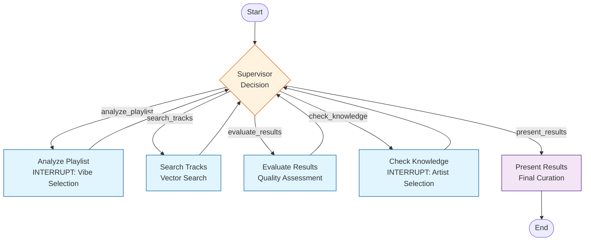

# For local development

## you might port-forward the k3s postgres services:

```sh
kubectl port-forward service/postgres-service 5432:5432 -n glasgow-prod
```

and

```sh
kubectl port-forward -n glasgow-prod svc/minio-service 9000:9000
```

# or maybe just port forward the prod api directly

```sh
kubectl port-forward -n glasgow-prod svc/fastapi-msv2-api-service 8000:8010
```

# Then start the app

```sh
uvicorn api.main:app --reload --host 0.0.0.0 --port 8000
```

# Music Curator Agent v3

## Architecture Overview

The **Music Curator Agent** is a truly agentic LangGraph system that autonomously curates personalized playlists. It uses an LLM-powered supervisor to make intelligent decisions about search strategy, quality evaluation, and when to present results.

### Key Features

- **Autonomous Decision Making**: Supervisor uses LLM to reason about next steps
- **Adaptive Search Strategy**: Automatically adjusts constraints based on results
- **Loop Prevention**: Detects and breaks out of infinite loops
- **Minimal User Interruption**: Only 2 questions maximum (vibe + artist knowledge)
- **Graceful Failure Handling**: Handles errors and edge cases intelligently

### Agent Flow



## Detailed Component Logic

### Supervisor Node (`supervisor.py`)

- **Input**: Current `AgentState`
- **Action**:
  - Analyzes state (flags, data, history)
  - Builds context prompt with decision rules
  - Calls LLM with structured output
  - Decides next action based on state
  - Prevents loops (detects same action 3x)
  - Enforces max 10 iterations
- **Output**: `next_action`, `reasoning`, `parameters`

### Tool Nodes (`tools.py`)

#### 1. analyze_playlist

- Fetches playlist statistics (BPM, energy, genres)
- Validates playlist has at least 5 tracks
- Generates description with LLM
- Creates 4 vibe options
- **INTERRUPTS** for user vibe selection

#### 2. search_tracks

- Calculates playlist centroid (average vector)
- Applies vibe-based constraints
- Adaptive: Relaxes constraints on retry
- Performs vector search
- Excludes known artists

#### 3. evaluate_results

- Calculates quantity score (candidates / 50)
- Calculates quality score (1 - avg_distance)
- Calculates diversity score (unique_artists / 20)
- Returns overall assessment

#### 4. check_knowledge

- Extracts unique artists from top 20 candidates
- Creates options with "None" and "All"
- **INTERRUPTS** for user artist selection

#### 5. present_results

- Filters by known artists
- Selects top 5 tracks (prioritizes unknown)
- Generates LLM pitch for each track
- Generates overall justification
- Returns final UI state

---
